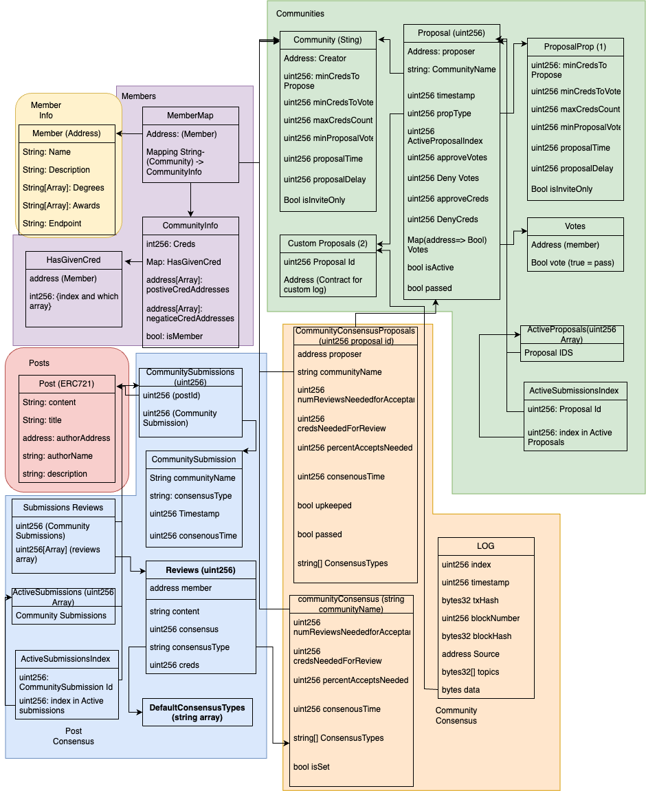

# Decentralized Peer Review platform with Chainlink Automation 

Learn Tgether is a Decentralized Peer Review Platform built to Enable Dynamic Communities the ability to form consenous on any piece of content on the internet.

## Overview

The project consists of 6 primary smart contracts:

1. **learntgetherCommunities**: This contract manages Communities relevent to the platform. A community is a set of are made up of a set of paramteters defining their membership and democratic process.

2. **learntgetherMembers**: This contract manages the Members of Communities. Communities have a karma based "cred" system. Members can apply cred postively or negatively on a per community basis.

3. **learntgetherMemberInfo**: This contract is a bit of filler, but allows for users to add a bit of info about themselves.

4. **learntgetherCommunityConesnsus**: This Contract provides the parameters for consenous defined by a community. New proposals for these values are created from this contract, while voting takes place on the original "Communities Contract" as a "Custom proposal."

5. **learntgetherPosts**: This Contract allows users to create nfts linked to endpoints around the web, for use to review and come to consenous on. These nfts are not meant to show ownership of content posted, and the signee of NFT minting transactions are liable for any legal action taken for content they mint.

6. **learntgetherPostConsensus**: This contract allows users to submit a post for a consenus review by a community. Communities can choose to accept or reject this content for their message or use case.

## Facilitating Decentralized Communities

### Dynamic Governance

The system is designed to be flexible, allowing communities to define their own rules and parameters. This means that each community can have its own unique governance model. Whether a community desires a fully democratic approach where every member has equal say or prefers a more autocratic model. It is up to them. 

### Peer Review System

The peer review system exemplifies the power of decentralized consenus. Reviewers, who are vetted and approved based on their credentials, review posts. The system ensures transparency and fairness, with Chainlink Automation automating the review process. The parameters for review, are desugned to be flexible and transparent in the same model described by the governance section above.

### Infinite Expansion

Following the example of learntgetherCommunityConesnsus Communities can extend their reach and define new use cases as needed. Note our Goal for this project is to not create "DAO's" these are simple transparent systems meant to solve specific problems, however use them as you see fit.

## Data Model

## Future Plans
- Payouts for incentivized Review
- Front End
